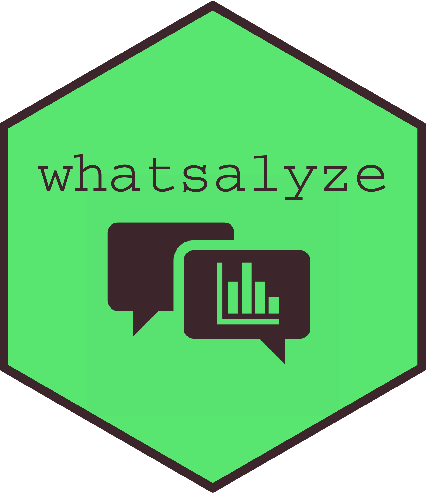

# whatsalyze 

Whatsalyze provides a shiny app to analyze your whatsapp chats\! You can
easily import your chats as exported `<chat>.txt` files and get some fun
insights\! 🕵

It is written using the golem framework for production-grade and robust
shiny apps. The shiny app is embedded inside the structure of an R
package which allows not only a concise and well structured workflow but
also the integration of documentation (roxygen2) and tests (testthat).

## Installation

You can install the current version of `whatsalyze` from Github with:

``` r
# install.packages("devtools")
devtools::install_github("EmanuelSommer/whatsalyze")
```

## Usage locally

The nice thing about running this app locally is, that your sensible
chat data does not leave the comfort of your own computer\! And it is
quite easy too\! Just run the following in your R console:

``` r
whatsalyze::run_app()
```

## Input format

The input format for the `<chat>.txt` files should be the following:

    31.01.20, 16:44 - User1: TextTextText
    31.01.20, 16:46 - User2: TextTextText
    11.02.20, 18:00 - User2: TextTextText
    ...

For more information on the input format see `rwhatsapp::rwa_read()`.

## Current features

  - Overall stats
      - Duration in days
      - Longest chat streak
      - Total messages
      - Total words
      - Words per message
      - Total media and voicemails (only if chat is exported in german
        as implemented with german regular expression)
      - Messages per day
      - Words per day
  - Activity visualizations
      - Activity by weekday
      - Activity by hour and weekday
  - Visualization of message and word frequencies by user
  - Visualization of the frequency of conversation starters by user
    (after at least 5 days)
  - Visualization of time vs messages sent per day (also by user)
  - Density plots (Gaussian kernel variable bandwidth) of words and
    emojis per message by user respectively
  - Boxplot of words and emojis per message by user respectively
  - Visualization of the top 10 emojis used by user

**If you have any suggestions for improvement or issues I would really
like to hear from you\!**

-----

<center>

👋 **Have fun\!** 👋

</center>
